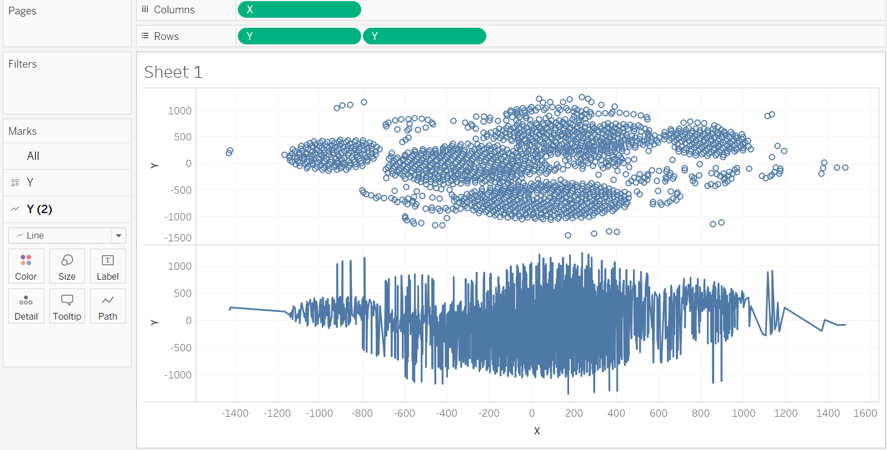
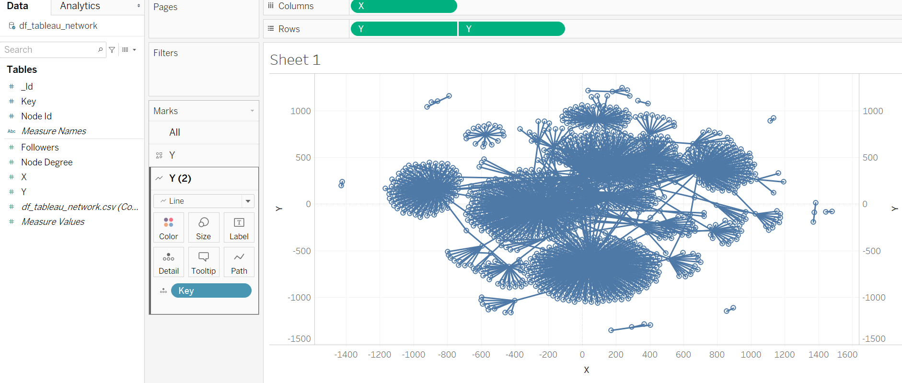

# network-analysis-using-python-and-R

## This repo is to study network analysis using Python, R, Gephi, and Tableau

## Functionalities
1. Read data from MongoDB dumped gzip file (file with extension: xxx.bson.gz) using Python
    - Python module required: pymongo (version 3.11.4), pandas (version 1.2.1)
    - use bson_reader() function in bson_dump_read.py to convert xxx.bson.gz file into file_iterator or file list
    - use bson_to_dateframe() function in bson_dump_read.py to convert the file_iterator into a dataframe with batch read in.

2. Plot large size network graph using Python and Gephi
    1. Read the edges .csv file into dataframe using pandas
    2. save it as xxx.gexf file using dataframe_to_gexf() function in Gephi_to_dataframe.py script, then open it in Gehpi application, play with the layout until you are satisfied
    
    3. save your satisfied layout as processsed_xxx.gexf file
    4. use gexf_to_dataframe() function in Gephi_to_dataframe.py to convert gexf file to a dataframe 
    5. plot the network nicely using the coordinates extracted from the processed_xxx.gexf file using network_plot() function in Gephi_to_dataframe.py 
    
    6. see example 

3. Plot large network graph using Tableau
    1. create the "df_tableau_network.csv" using functions in script Tableau_file.py (see details inside the .py file)
    1. use Tableau to read in the saved csv file "df_tableau_network.csv" as txt file, select an empty sheet in Tableau
    2. drag X into Columns, drag Y twice into Rows, set all X and Y into dimension data types
    3. on Marks section, change Y(2) to Line type
    
    4. right click one of the Y, select "Dual Axis"
    
    5. right click the merged Y, select "Synchronize Axis"
    
    6. add "key" column to Y(2) detail
    
    7. fine-tuning the edge thickness, color, and nodes thickness, color, etc.
    
    8. see examples 